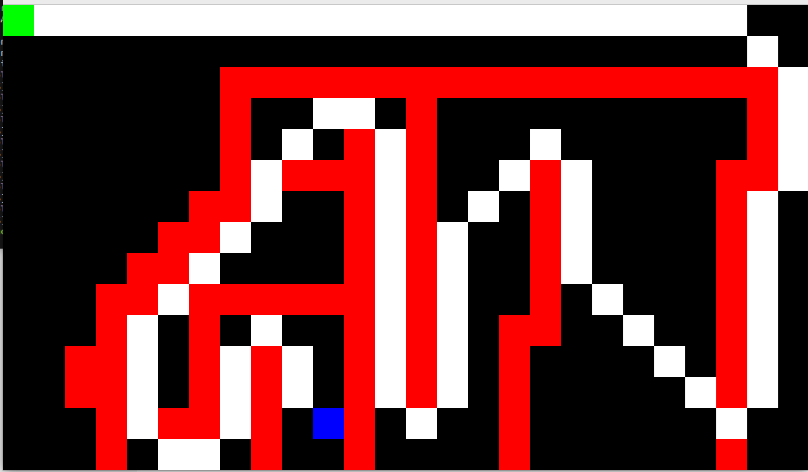

# Path Planner

This is a simple and robust C++ library providing the implementation of famous pathfinding algorithms, A* and Dijkstra. It is designed to find the shortest path in a 2D grid-based environment using the techniques of these two popular algorithms.

A grid map is created by taking an array of booleans where true denotes an obstacle, and false denotes a walkable area. The library is built to be flexible and easy-to-use, with configurable options for handling different path planning scenarios.




## Getting Started

These instructions will get you a copy of the project up and running on your local machine for development and testing purposes.

### Prerequisites

You need to have `cmake` and a C++ compiler installed on your system. Also, make sure to clone the repo with the `--recursive` flag to fetch the required submodules (SDL and yaml-cpp).

```bash
git clone --recursive https://github.com/cjdyer/path-planner.git
```

### Building

To build the project:

1. Create a build directory and navigate into it:

```bash
mkdir build
cd build
```

2. Run CMake to configure the project and generate a build system:

```bash
cmake ..
```

3. Build the project:

```bash 
make
```

4. Run the application:

```bash
./path_planner
```

## Usage

In your C++ program, include the required headers and use the AStarPathPlanner or DijkstraPathPlanner classes to compute paths:

```c++
#include "path_planner.h"

auto planner = build_path_planner(PlannerType::ASTAR);
auto path = planner.plan_path(map, start, end);
```

## Configuration

You can adjust the application settings such as window size and map layout in the config.yaml file.